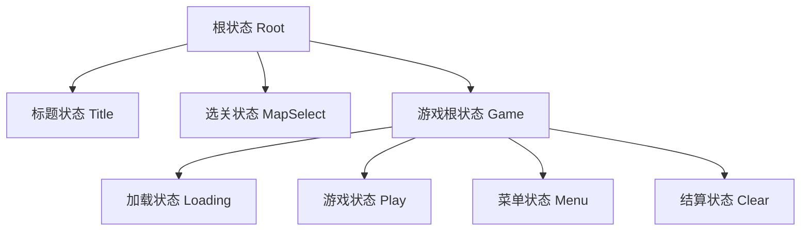

- # boxman

《世嘉新人培训教材》中推箱子游戏的实现

### 环境和依赖

- `VS2019` on `Windows10`
- 使用《世嘉新人培训教材》中提供的`GameLib`库

### 文件结构

- `maps`文件夹下存储游戏的地图文件(字符格式)

  ##### 地图文件格式

  - 首行两个数字代表地图的行数n和列数m(注意行数不能大于7，列数不能大于10)
  - 其后n行m列，对应字符表示该位置的物体，其中`+`表示墙壁，空格表示空地，`.`表示目标地点，`#`表示箱子，`@`表示人的位置

- `images`文件夹下存储游戏所需的图形资源文件

- `Sequence`文件夹下存储的是游戏状态类，完成状态迁移的功能

- 根目录下的`File.h`和`Image.h`完成文件读入功能和图片资源载入及绘制的功能，`GamePlay.h`完成游戏中的核心逻辑，`Animation.h`完成人物及箱子移动的动画，`Boxman.cpp`相当于主函数文件，完成游戏中的主循环

### 游戏状态示意图

### 项目总结

1. 头文件尽量**避免循环包含**，必要时可以用类声明代替`include`
